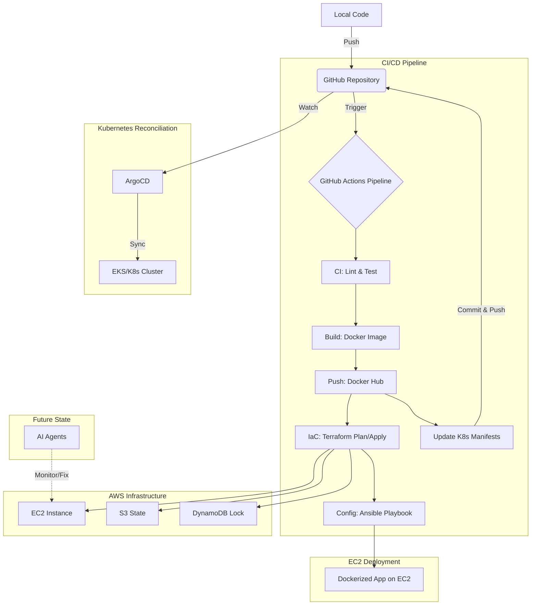

# CI/CD & SRE Lab: From Scratch to AIOps 🚀

This repository is a comprehensive laboratory for exploring modern DevOps and **SRE** (Site Reliability Engineering) practices, transitioning from manual infrastructure management to fully automated **AIOps**. 

The project demonstrates a "3-Tier" application stack (API + Database) initially deployed on AWS and currently running locally on Docker/Kubernetes and managed by ArgoCD for Kubernetes reconciliation.

## 🌟 The Vision

The goal is to evolve this lab through several phases:
1.  **Foundational Infra**: Manual setup and basic scripting.
2.  **Infrastructure as Code**: Provisioning with Terraform.
3.  **Automation & Configuration**: Automating server setup with Ansible.
4.  **GitOps & Reconciliation**: Implementing **ArgoCD** for automated Kubernetes reconciliation.
5.  **Containerization & Orchestration**: Moving to Docker and Kubernetes.
6.  **Observability (SRE)**: Implementing Prometheus and Grafana for deep system insights and custom dashboards.
7.  **AIOps (Current Focus)**: Integrating AI agents to automatically manage, troubleshoot, and resolve infrastructure issues.

---

## 🏗 Architecture & Flow



---

## 📂 Project Structure

| Directory | Purpose |
| :--- | :--- |
| [`/app`](./app) | **FastAPI Application**: The core business logic, including database models and routes. |
| [`/terraform`](./terraform) | **Infrastructure as Code**: AWS resource definitions (EC2, VPC, etc.) organized by environments and modules. |
| [`/ansible`](./ansible) | **Configuration Management**: Playbooks to bootstrap servers and deploy the application. |
| [`/k8s`](./k8s) | **Kubernetes Manifests**: Kustomize-based configurations for container orchestration. |
| [`.github/workflows`](./.github/workflows) | **CI/CD Pipeline**: The automation engine (GitHub Actions) connecting everything. |

---

## ⚙️ CI/CD Pipeline Breakdown

The [`pipeline.yml`](./.github/workflows/pipeline.yml) is the heart of this lab. It executes the following stages:

1.  **Set Environment**: Dynamically detects the environment (`dev`, `staging`, `prod`) based on the git branch.
2.  **CI**: Runs Python dependency checks and unit tests.
3.  **Build**: 
    - Builds a Docker image tagged with the commit SHA.
    - Pushes the image to **Docker Hub**.
    - Automatically updates the Kubernetes deployment manifests with the new image tag.
4.  **Terraform Plan**: Generates an execution plan for AWS infrastructure.
5.  **Terraform Apply**: 
    - Provisions/Updates AWS resources.
    - Retrieves the public IP of the new/updated EC2 instance.
6.  **Ansible Deployment**: 
    - Injects the EC2 IP into the Ansible inventory.
    - Connects via SSH to install Docker and run the application container.
7.  **ArgoCD Sync**:
    - Watches the repository for changes in the [`/k8s`](./k8s) directory.
    - Automatically reconciles the state of the Kubernetes cluster with the updated manifests.

---

## 🛠 Tech Stack

*   **Cloud**: AWS (EC2, S3, DynamoDB)
*   **IaC**: Terraform
*   **Config Management**: Ansible
*   **Application**: Python 3.11, FastAPI, PostgreSQL
*   **Containerization**: Docker & Kubernetes
*   **GitOps / Reconciliation**: ArgoCD
*   **Monitoring**: Prometheus & Grafana
*   **Pipeline**: GitHub Actions

---

## 🚀 Getting Started

### Prerequisites

To run this project, you will need:
- An **AWS Account** with programmatic access.
- **Docker Hub** credentials.
- A **GitHub Repository** to host the code and secrets.

### Required GitHub Secrets

| Secret Name | Description |
| :--- | :--- |
| `AWS_ACCESS_KEY_ID` | Your AWS access key. |
| `AWS_SECRET_ACCESS_KEY` | Your AWS secret key. |
| `DOCKERHUB_USERNAME` | Your Docker Hub username. |
| `DOCKERHUB_TOKEN` | A personal access token for Docker Hub. |
| `EC2_SSH_KEY_B64` | Base64 encoded private SSH key for EC2 access. |

### Local Development

1.  **Clone the repository**:
    ```bash
    git clone https://github.com/dlgborges/cicd-lab.git
    cd cicd-lab
    ```
2.  **Run the App locally** (requires Docker):
    ```bash
    docker-compose up --build
    ```
3.  **Access the API**:
    - Root: `http://localhost:8000/`
    - Health: `http://localhost:8000/health`
    - Users: `http://localhost:8000/users`
    - Trigger Error: `http://localhost:8000/error`

---

## 🤖 The AIOps Roadmap

The ultimate goal is to integrate **AI Agents** that can:
- **Monitor**: Scrutinize logs and Prometheus metrics.
- **Analyze**: Identify the root cause of failures (e.g., database connection timeouts).
- **Act**: Trigger Terraform/Ansible fixes or restart services automatically.

---
*Created and maintained by @dlgborges*
